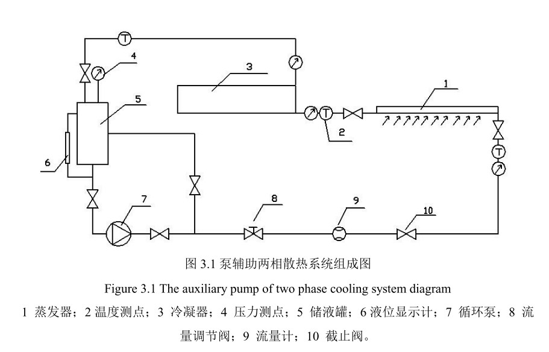

# 泵辅助两相散热系统的设计与实验研究

什么泵？**循环泵**
工质？**高温制冷剂R114**，==沸点==（只有饱和压力没有饱和温度）
给什么散热？电子芯片（应该是航空航天领域的电子芯片）
功率400W
==温差==
* 实验原理

在储液罐中具有一定过冷度的制冷剂R114，在定容积齿轮泵的驱动下，进入蒸发器对电子元器件进行冷却，使得部分制冷剂发生相变，成为具有一定干度的汽液两相混合物，并在压差的驱动下进入冷凝器进行冷却，使其冷凝成为具有一定过冷度的制冷剂液体，重新流回制冷剂储液罐，从而完成两相散热系统的一次循环
* 主要内容

本文设计并选购组成两相散热实验系统所需的齿轮泵、蒸发器和冷凝器三大部件，并详细地讨 论了其选型的限制条件和参考因素。齿轮泵选取流量均匀、恒定，没有脉动现象 的磁力驱动齿轮泵；冷凝器选用卧式管壳式水冷冷凝器；蒸发器以铝合金为材料 采用微铣切割方式，设计并加工出 26 条1mm×3mm 的矩形槽道群

* 实验结论

① 在阻力特性方面，在单相流动时，矩形槽道的摩擦阻力和雷诺数间近似呈 线性关系，摩擦阻力随着雷诺数的增大而增大；两相流动时，在体积流量 为 28L/h 条件下，流体工质在槽道内的`两相压(这意味着什么？)`降随着加热功率的增大而增 大。
② 在换热特性方面，单相流时在体积流量为 80L/h 条件下，`局部换热系数(与其他换热系数的关系？)`随 电加热片功率的增加基本保持不变；在体积流量为 28L/h 的两相流动条件 下，电加热片区域的局部传热系数随电加热片功率的增大而增大。

####摘要

>使其采用传统的风冷或水冷散 热方案已经不能满足其散热要求

是否有证明？尤其是水冷也不行么？

==常规蒸汽压缩式制冷系统与本文的系统区别==

####总结与展望
1. 解决==高热流密度、离散热源==的电子元器件的散热问题
2. 单向流和两相流时，左右电加热片区域的温度分布的均匀性较好；

不足
* 槽道为单一尺寸
* 仅用实验研究了压降特性和换热特性
* 仅研究了一种工质

####绪论
1. 现在芯片发热功率及热流密度是多少？
2. 随着散热，芯片温度逐渐下降，过热度是否还能保证沸腾换热的发生？
3. 单相可到到790W/cm^2,(见参考文献18)，是否还需要相变？
   >在环境温度为 25℃的条件下，能够满足功率为400W离散型芯片的散热需求
4. 按照Bo数的分类，本文是？本文的通道尺寸是？
5. 室温为25℃，制冷剂显著低于室温，过热度>25
####总体设计
毛细泵与机械泵？
**单蒸发器回路**
#####实验台
* 主体试件（蒸发器和电加热装置）铝合金1060H24；平行结构
  1. 所以热沉是水？

2. 制冷剂泵和磁力驱动泵组成循环泵？

3. Laminar 层流模型（体积流量为 50L/h 时，Re 数为 1764.5）
4. 假定工质的干度为0.4，槽道内壁温与工质的温差为3℃（该实验最大特点应该为离散热源，恒温条件的话为什么不直接套用非离散的结论）
* 制冷剂供给系统
1. R124 只能用在冷凝温度小于 90℃ 的工况？（这有什么问题，并不知道环境温度是多少）
>系统需要长期工作在 50～60℃
* 数据测量系统
* 冷却水循环系统
####实验
