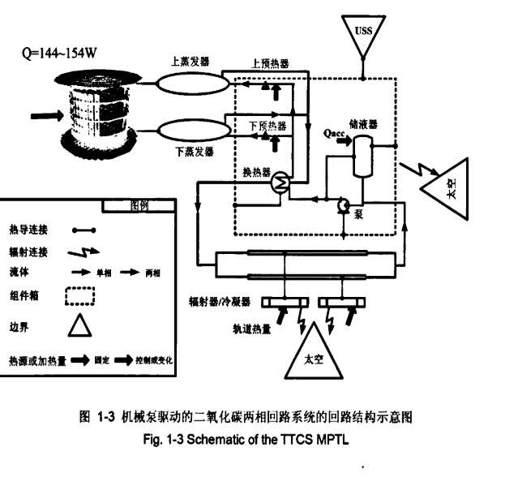

###机械泵驱动co2两相流体回路稳定性研究

>空间高能粒子探测器(AMS-02)的并联蒸发器，进行了包括热载荷启动时以及运行时的稳定性实验研究。

==重点1==：（爆炸沸腾）热载荷启动时小管径中的形核沸腾会产生压力冲击，强度足够大时会导致工质回流，出现烧干现象，引发不稳定性（直接原因是工质在低温工况下的过热现象）

解决方法：通过首先启动换热器上的启动加热器，使C02过冷液体在其内部完形核沸腾，随后进行蒸发器的热载荷启动。

机械泵驱动单相流体回路系统的缺点
>沿程的热传输管路会有温升，且上游热源的热载荷变化会直接影响下游热源所处的温度环境。

等温化设计
>如何研发功耗小，重量轻，寿命长的机械泵

技术指标
>硅微条的工作温度：-15/+25℃
硅微条的生存温度：-20/+40℃
硅微条温度的时间稳定性：绕轨道一周小于3℃ 
不同硅微条层间的最大温度差：10℃
所需蒸发器的沿程温度差：<1℃

单相回路沿程温差>10℃,无法达到设计要求
工质就是co2
工作原理：

?铠装加热丝
加热储液罐来增加压力

